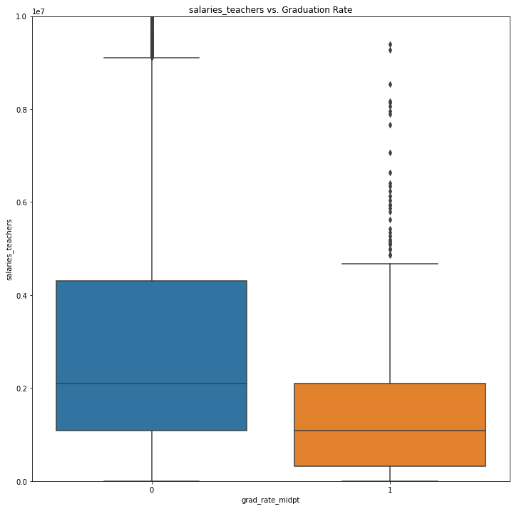
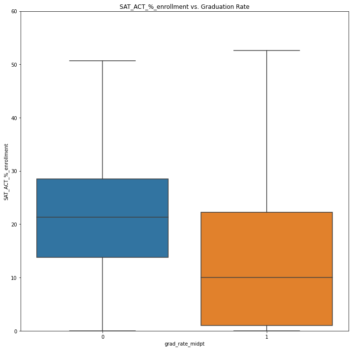

# Graduation Rates in the Tri-state area

**Author**: [Becky Strickland]


## Business Problem

Predict which schools have high and which schools have low high school graduation rates. Identify which characteristics are the best indicator of high and low graduation rates so that school districts know where to focus resources when attempting to increase high school graduation rates.

## Data
Urban Institute
https://educationdata.urban.org/documentation/index.html
Data was consolidated by the urban institute from the following sources:

Common Core of Data
https://nces.ed.gov/ccd/

The Civil Rights Data Collection
https://ocrdata.ed.gov/

Small Area Income and Poverty Estimates
https://www.census.gov/programs-surveys/saipe.html

EDFacts
https://www2.ed.gov/about/inits/ed/edfacts/index.html

Integrated Postsecondary Education Data System
https://nces.ed.gov/ipeds/

College Scorecard
https://collegescorecard.ed.gov/

National Historical Geographic Information System
https://www.nhgis.org/

Federal Student Aid
https://studentaid.gov/data-center

National Association of College and University Business Officers
https://www.nacubo.org/

National Center for Charitable Statistics
https://nccs.urban.org/


## Methods

This project uses binary classification to predict which highschools have a high and which highscools have a low graduation rate. 

## Results

### Describe indicator of graduation rate


### Describe indicator of graduation rate

 
 


### Describe indicator of graduation rate


### Describe indicator of graduation rate


 
### Describe indicator of graduation rate

 
 

### Describe indicator of graduation rate

 


### Describe indicator of graduation rate
> 
 
 

 
### Describe indicator of graduation rate
 
 
 


### Describe indicator of graduation rate
 
 
 


## Conclusions


## Recommendations


## Next Steps


## For More Information

See the full analysis in the [Jupyter Notebook](./Movie-Analysis.ipynb) or review this [presentation](./Movie-Analysis-Presentation.pdf).


## Repository Structure

```
├── Data
├── Images
├── Movie-Analysis.ipynb
├── GitHub-print.pdf
├── Movie-Analysis-Jupyter-Notebook.pdf
├── Movie-Analysis-Presentation.pdf
└── README.md
```