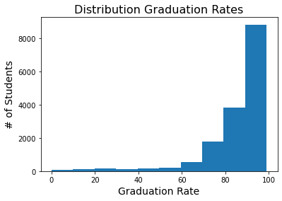

# Graduation Rates in the Tri-state area

**Author**: [Becky Strickland]

## Background

Every year, the federal government releases large amounts of data on U.S. schools, school districts, and colleges. But this information is scattered across multiple datasets that are often difficult to access, and changes in data structure complicate efforts to measure change over time. The Urban Institute (https://educationdata.urban.org/documentation/index.html) has organized and consolidated this data to make it easier to combine data from different reporting sources.

Using the Urban institutes consolidated data platform we will be combining datasets describing characteristics and metrics of individual schools with data describing characteristics at the school district level.

We will use this data to build a classification model which classifies high schools as either having a low or high graduation rate. The distinction between low and high graduation rates is based on the federal government's standard that those schools with less than two thirds of class graduating are low graduation rate schools.

## Business Problem

Predict which schools have high and which schools have low high school graduation rates. Identify which characteristics are the best indicator of high and low graduation rates so that school districts know where to focus resources when attempting to increase high school graduation rates.

## Data


Urban Institute
https://educationdata.urban.org/documentation/index.html
Data was consolidated by the urban institute from the following sources:

Common Core of Data
https://nces.ed.gov/ccd/

The Civil Rights Data Collection
https://ocrdata.ed.gov/

Small Area Income and Poverty Estimates
https://www.census.gov/programs-surveys/saipe.html

EDFacts
https://www2.ed.gov/about/inits/ed/edfacts/index.html

Integrated Postsecondary Education Data System
https://nces.ed.gov/ipeds/

College Scorecard
https://collegescorecard.ed.gov/

National Historical Geographic Information System
https://www.nhgis.org/

Federal Student Aid
https://studentaid.gov/data-center

National Association of College and University Business Officers
https://www.nacubo.org/

National Center for Charitable Statistics
https://nccs.urban.org/


## Methods

This project uses binary classification to predict which highschools have a high and which highscools have a low graduation rate. 


### Distribution of National Graduation Rates
- Graduation rates are skewed towards low graduation rates. Low graduation rate high schools are the minority class making up less than 10% of all high schools.
- We will need to adjust for this imbalance in the modeling stage




## Conclusions
Our modeling struggles with overfitting and is better at classifying the majority class (normal graduation rate). However, we were able to achieve a high enough performance that we feel confident in making recommendations based on the the features which had the greatest feature importance for our modeling.
The number of students who completed math and reading tests and received a proficient grade were major indicators for higher graduation rates.
Our modeling showed that the proportion of suspensions and lengthier suspensions were a major indicator for low graduation rate high schools.
The number of students participating in ACT/SAT tests was a strong indicator for our model. Higher participation meant higher likelihood of being in a normal graduation rate group.
Teacher salaries was the most important financial factor. Higher teacher salaries were an indicator of normal high school graduation rates.


## Recommendations
Mathematics and Reading: Focus resources  on providing extra support for mathematics and reading. School districts should investigate the best way to improve these scores whether it be through offering remedial opportunities additional tutoring or increasing testing practice for these specific areas.
Suspensions: Although, these metrics are not easily separated from other influencing factors. We can broadly say that behavioral issues have a negative impact on academic success. Additionally, there is a large and accepted body of research in the education field that dealing with behavioral issues by keeping kids from coming to school is unproductive and has negative impacts on academic success. School districts and administrators should investigate more productive disciplinary recourse than suspensions and explore preventative measures that help students work through behavioral issues.
ACT/SAT: As with many education metrics ACT/SAT participation likely also has a relationship with school funding and other types of factors. However, regardless of other factors ACT/SAT prep can be a motivating factor for students even at underfunded schools. With the view that the main goal for students in high school is to prepare themselves so they will be accepted into college
Teacher Salaries:  Teacher salaries  is a the top financial feature for our modeling an is also more easily influenced by school districts than other financial factors such as local revenue. We recommend making teacher salaries the top priority in budgeting plans as this was a strong indicator for higher graduation rates.
Wait until future work is completed to use a model as a primary classification technique


## Next Steps

Perform feature selection steps to improve overfit of the modeling.
Investigate adding new features. Now that we have a better handle on which types of features are important we should investigate adding new features from our reporting sources and also engineering new features with the data we already have on hand. Engineering features to make them proportional to the overall population of the graduating class could make them stronger and more informative. 
For example, % of students participating in ACT/SAT per cohort would be a much better metric than the total number.
Investigate which types of schools did not report graduation rates. We need to know if we are missing any important type of data for unreported graduation rates. Is the type of schools not reporting graduation rates similar to those that do report?


## For More Information

See the full analysis in the [Jupyter Notebook](./capstone-graduation-analysis.ipynb) or review this [presentation](./ppt-pdf.pdf).


## Repository Structure

```
├── Data
├── Images
├── capstone-graduation-analysis.ipynb
├── GitHub-print.pdf
├── capstone-graduation-analysis - Jupyter Notebook.pdf
├── ppt-pdf.pdf
└── README.md
```